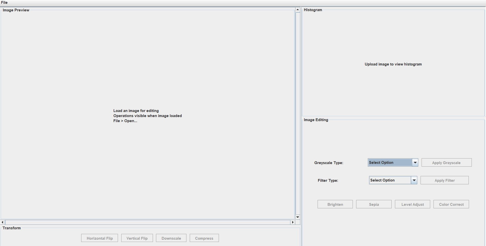
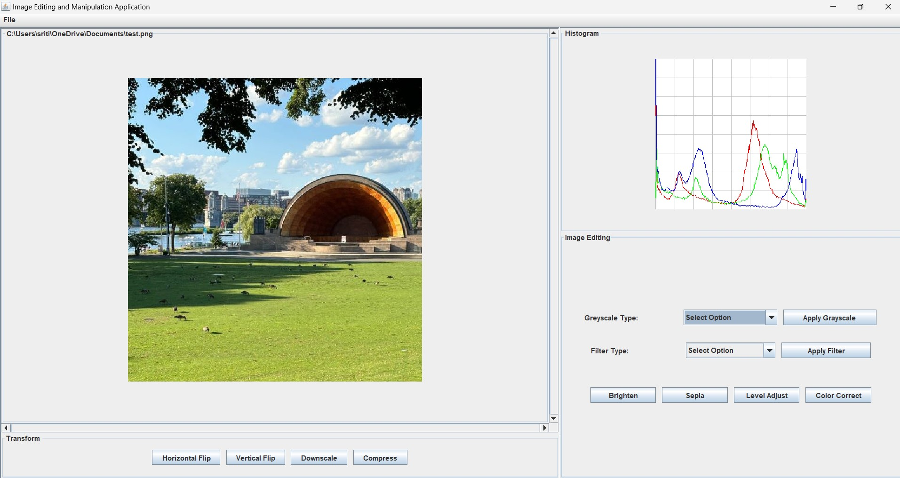
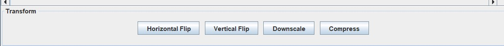
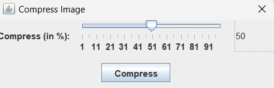
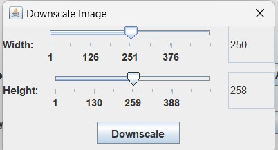
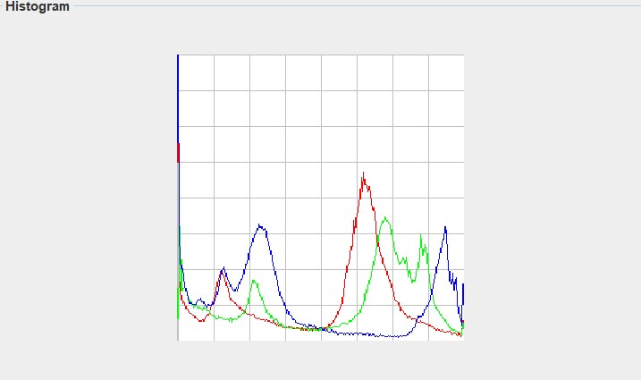
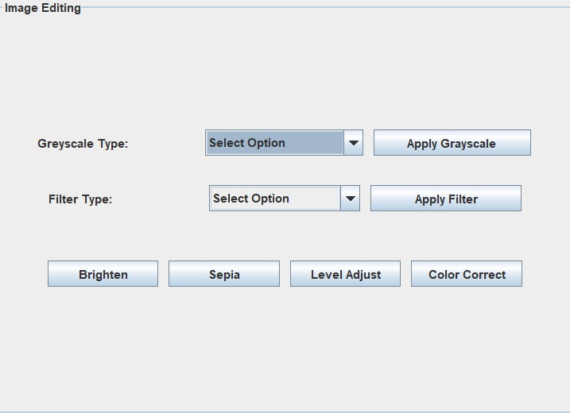
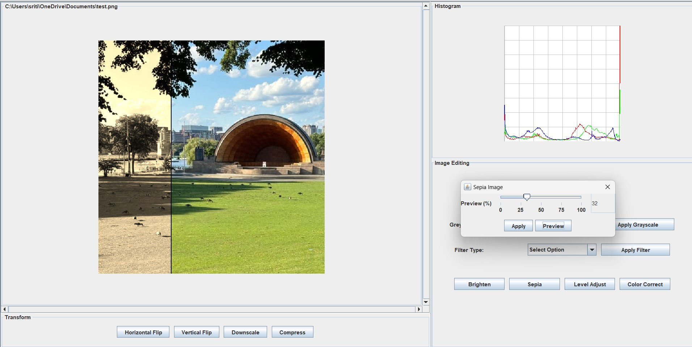
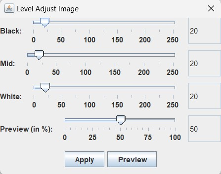

# How to use this software

## How to run the application

## GUI

### IntelliJ

1. Goto ApplicationRunner in src/application
2. Run the application without any command line arguments.

### Using Jar

1. Download jar from res/ folder
2. Run the jar by java -jar jarName.jar

### Terminal

1. Go to src folder
2. Compile the java files
3. Then run src> java application.ApplicationRunner

## Command line text/ file

### CLI on IntelliJ

1. Goto ApplicationRunner in src/application
2. Run the main method and set the command line arguments by using -text for inline commands or
   -file filePath.txt

***In IntelliJ:**
While running path make sure you keep the path relative to root folder. For example if your script
is
in res then run ./res/filename.txt*

### CLI on terminal

1. Go to the src folder and compile.

``` 
cd src
javac application/model/Image.java application/model/AbstractImage.java application/model/RGBImage.java application/controller/AbstractController.java application/controller/ImageUtil.java application/controller/ImageController.java application/ApplicationRunner.java
```

- To run a script file go to src folder and run

```
// To run a txt file
java application.ApplicationRunner

//In terminal
run <path of script.txt>
```

****In Terminal:**
While running path make sure you keep the path relative to src. For example if your script is
in res then run ../res/filename.txt*

## GUI buttons the software support



The above image shows the initial layout for GUI. All operations are disabled when no image is
loaded.



The image shows a loaded image in the application.



The transformations panel can make basic transformation like flips and advanced operations like
compress and downscale.



The compress parameters which can be edited on an image . Range 0 to 100.



The downscale parameters of width and height of an image.



The histogram panel shows the live histogram of the current image displayed on the screen.




The editing panel shows all the operations you can do on an image.



The split preview is available on all the operations panel buttons. 



The level adjust parameters which can be edited on the image.


## Commands the software support

### Load a file.

```
load test.ppm test-ppm
load test.png test-png
load test.jpg test-jpg

```

### Save a file.

```
save test-ppm.ppm test-ppm
save test-png.png test-png
save test-jpg.jpg test-jpg
save test-bmp.bmp test-bmp
```

### RGB Split

```
rgb-split image-name red-dest-name green-dest-name blue-dest-name
```

### RGB Combine

```
rgb-combine combined-image-name red-image-name green-image-name blue-image-name
```

### Brighten

```
brighten increment image-name dest-image-name
```

### Value component

```
value-component image-name dest-image-name
```

### Luma component

```
luma-component image-name dest-image-name
```

### Intensity component

```
intensity-component image-name dest-image-name
```

### Red component

```
red-component image-name dest-image-name
```

### Green component

```
green-component image-name dest-image-name
```

### Blue component

```
blue-component image-name dest-image-name
```

### Horizontal Flip

```
horizontal-flip image-name dest-image-name
```

### Vertical Flip

```
vertical-flip image-name dest-image-name
```

### Sharpen

```
sharpen image-name dest-image-name
```

### Blur

```
blur image-name dest-image-name
```

### Sepia

```
sepia image-name dest-image-name
```

### Compress

```
compress percentage image-name dest-image-name
```

### Histogram

```
histogram image-name dest-image-name
```

### Color Correct

```
color-correct image-name dest-image-name
```

### Levels Adjust

```
levels-adjust b m w image-name dest-image-name
```

### Split an image

```
blur image-name dest-image split percenatge
```

- The commands that support the split feature are blur, sharpen, sepia, greyscale, color correction
- and levels adjustment.

### Downscale an image

```
downscale height width image-name dest-imag-name
```

### Partial image manipulation (PIM)

```
blur image-name mask-image dest-image-name
```

- The command for partial image manipulation are supported by blur, sharpen, grayscale, sepia,
  channel component.
- A maks image of the same size as the image-name must be loaded before PIM.
- Only black and white mask are supported.


